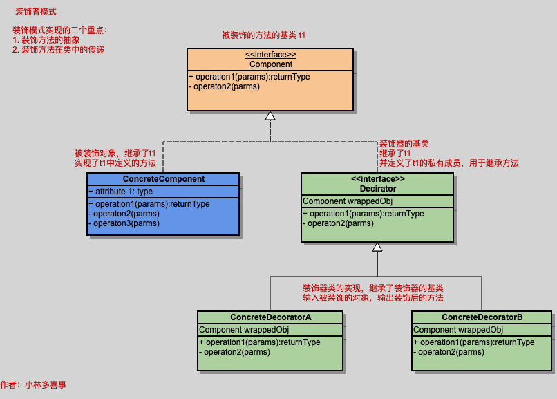

装饰器模式是比较常用的一种设计模式，Python中就内置了对于装饰器的支持。
装饰模式指：动态地给一个对象添加一些额外的职责。就增加一些功能来说，装饰模式比生成子类更为灵活。

\无论何时我们想对一个对象添加额外的功能，都有下面这些不同的可选方法。

如果合理，可以直接将功能添加到对象所属的类（例如，添加一个新的方法）
使用组合
使用继承
注意，本文中的Decorator可以为装饰器或者修饰器。

与继承相比，通常应该优先选择组合，因为继承使得代码更难复用，继承关系是静态的，并且应用于整个类以及这个类的所有实例（请参考[GOF95，第31页]和网页[t.cn/RqrC8Yo]）。

设计模式为我们提供第四种可选方法，以支持动态地（运行时）扩展一个对象的功能，这种方法就是修饰器。修饰器（Decorator）模式能够以透明的方式（不会影响其他对象）动态地将功能添加到一个对象中（请参考[GOF95，第196页]）。

在许多编程语言中，使用子类化（继承）来实现修饰器模式（请参考[GOF95，第198页]）。在Python中，我们可以（并且应该）使用内置的修饰器特性。一个Python修饰器就是对Python语法的一个特定改变，用于扩展一个类、方法或函数的行为，而无需使用继承。从实现的角度来说，Python修饰器是一个可调用对象（函数、方法、类），接受一个函数对象fin作为输入，并返回另一个函数对象fout（请参考网页）。这意味着可以将任何具有这些属性的可调用对象当作一个修饰器。在第1章和第2章中已经看到如何使用内置的property修饰器让一个方法表现为一个变量。在5.4节，我们将学习如何实现及使用我们自己的修饰器。

What is a Decorator
A decorator is the name used for a software design pattern. Decorators dynamically alter the functionality of a function, method, or class without having to directly use subclasses or change the source code of the function being decorated.

翻一下： 就是装饰器是一种软件设计模式，被用来动态修改函数、方法，或者类功能却不是通过子类，或者修改原代码实现。

The "decorators" we talk about with concern to Python are not exactly the same thing as the DecoratorPattern described above. A Python decorator is a specific change to the Python syntax that allows us to more conveniently alter functions and methods (and possibly classes in a future version). This supports more readable applications of the DecoratorPattern but also other uses as well.
Support for the decorator syntax was proposed for Python in PEP 318, and will be implemented in Python 2.4.

翻译下：Python的 decorators 与 DecoratorPattern并不完全相同。 Python的decorator是一种特殊：在语法上实现允许我们更灵活地更改方法，或者函数。

例子：

@classmethod
def foo (arg1, arg2):
    ....

具体来说，装饰器模式是用来给对象的行为增加某些特性或者对被装饰对象进行某些修改。
装饰器模式用于对被装饰的对象的行为进行扩充。
扩充包含两方面，第一是定义统一的接口，第二是继承原有的方法。
统一的接口通过定义一个基类，在基类中定义抽象的方法。
继承原有的方法，是通过在装饰器的基类中，定义一个私有基类成员。
装饰器的子类中，继承装饰器的基类，并传入被装饰的对象。

按照输入输出模型，输入一个装饰的对象，输出一个经过装饰的方法。

装饰器模型分为三个对象
1. 统一方法的基类对象
2. 装饰器的基类对象和装饰器类
3. 被装饰器装饰对象的底层类

如上图所示，需要被装饰的对象在最上方，它自身可以有自己的实例，一般通过抽象类来实现(Java中也可以通过接口实现)。

右侧中间是一个装饰器类或者接口，其实内容与原对象基本一致，不过我们自定义的装饰器一般会继承这个装饰器基类。

最下层就是具体的装饰器了，可以看到，具体装饰器类中需要包含被装饰对象成员（也就是说，装饰器需要和被装饰对象有同样的子类），然后增加一些额外的操作。

 

# 装饰器模式的优点：
1、可以轻松对已存在的对象进行修改和包装，在被装饰者的前面或者后面添加自己的行为，而无需修改原对象。
2、可以动态、不限量地进行装饰，可以更灵活地扩展功能。
相对地，装饰器模式有很明显的缺点：
1、会加入大量的小类，即使只添加一个功能，也要额外创建一个类，使得程序更复杂。
2、增加代码复杂度，使用装饰器模式不但需要实例化组件，还要把组件包装到装饰者中。

# 参考文档
[Python设计模式之装饰器模式](https://www.jianshu.com/p/013985a58841)