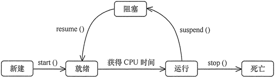

面向对象编程中，类用来表示对象，一般情况下，我们需要考虑用类来表示什么具体的东西。类对应的东西可能存在于真实世界中，也可能不存在于真实世界中。
状态模式所表示的类，一般就不存在真实世界的某个东西，因为状态模式中的类是用来表示状态的。状态一般都是抽象的，所以往往没有具体对应于真实世界的对象。
我们用类来表示状态，那么不同的状态就用不同的类来表示，我们只要通过切换不同的类就可以切换不同的状态。

行为模式关注的是对象的响应性，它们通过对象之间的交互以实现更复杂的功能。
状态模式是一种行为设计模式，在该模式中，一个对象可以基于其内部状态封装多个行为。
比如根据收音机的基本状态（AM/FM），
当调谐到 AM 或 FM 频道时，扫描频道的行为就会相应地发生动态的改变。
使用状态模式的具体的过程：
1. 抽象状态定义，抽象接口方法
2. 继承抽象状态，实现抽象方法
3. 包含状态，实现设置状态和工作逻辑

# 状态模式的分析
状态模式的角色：

## state状态
表示状态，定义了根据不同状态进行不同处理的接口，该接口是那些处理内容依赖于状态的方法集合，对应实例的state类

## 具体的状态
实现了state接口，对应daystate和nightstate

## context
context持有当前状态的具体状态的实例，此外，他还定义了供外部调用者使用的状态模式的接口。

状态模式的类图：

1. 抽象一个state类，并定义该状态下的行为为抽像的方法。
2. 具体的状态继承state类，实现state中抽象的方法
3. 定义context处理函数，实例化一个state对象，通过调用state的方法实现不同的处理逻辑

# 状态模式的优点

在状态设计模式中，对象的行为是其状态的函数结果，且行为在运行时依旧状态而改变。
这消除了对 if/else 或 switch/case 条件逻辑的依赖

使用状态模式，实现多态行为是很方便的，并且易于添加状态来支持额外的行为
状态模式提高了聚合性，针对状态的行为被聚合到 ConcreteState 类中，放置在代码的同一个地方
状态模式不仅改善了扩展应用程序行为时的灵活性，且提高了代码的可维护性。一个 ConcreteState 类即对应一种行为

# 状态模式的缺点

类爆炸：由于每个状态都需要在 ConcreteState 中定义，
可能导致创建太多功能较为单一的类。既增加了代码量，又使得状态机的结构更加难以审查
随着新行为的引入，Context 类需要进行相应的更新以处理每个行为，使得上下文行为更容易受到每个新行为的影响

# 状态模式的具体实例
## 金库报警
我们考虑设计一个金库警报系统，这个系统会根据白天晚上做出不同的响应。
有一个金库
金库与警报中心相连
金库里有警铃和电话
金库里有时钟

金库只能在白天使用
白天使用金库，会在警报中心留下记录
晚上使用金库，会向警报中心发送紧急事态通知

警铃白天晚上都能用
使用警铃，会向警报中心发送紧急事态通知

电话都可以使用
白天使用电话，会呼叫警报中心
晚上使用电话，会呼叫警报中心的留言电话

基本就是以上的需求逻辑。

如果我们不使用状态模式
那就是大概伪码如下：

使用金库调用的方法（） ｛
  if(白天) {
} else if(晚上) {
}
｝

正常通话时（） ｛
if（白天） ｛｝
else if(晚上) ｛
｝
｝
显然这样可以实现，也并没有什么错误。

但是状态模式确实从不同的角度来考虑问题。

状态模式会发现，这些不同的行为，主要依赖于两个状态，就是白天和晚上。所以状态模式会抽象出这两种状态，每个状态就会有自己的行为实现，比如白天这个状态会实现自己的使用金库的方法，通话的方法，晚上的类也会实现自己的行为逻辑，最后我们只要取得状态对象的委托调用他们的方法就行了，不管他们具体是怎么实现的。
我们看一下使用状态模式的伪码：

白天的状态类 {
      使用金库的方法
      使用警铃的方法
     通话的方法
}

晚上的状态类 {
      使用金库的方法
      使用警铃的方法
     通话的方法
}
我们看到普通方法和状态模式的区别就是状态模式中，定义了状态类，就不需要if语句来判断了。所以当我们遇到很多个ifelse语句的时候，往往可以考虑状态模式，

## 用“状态模式”设计一个学生成绩的状态转换程序。

分析：本实例包含了“不及格”“中等”和“优秀” 3 种状态，当学生的分数小于 60 分时为“不及格”状态，当分数大于等于 60 分且小于 90 分时为“中等”状态，当分数大于等于 90 分时为“优秀”状态，我们用状态模式来实现这个程序。

首先，定义一个抽象状态类（AbstractState），其中包含了环境属性、状态名属性和当前分数属性，以及加减分方法 addScore(intx) 和检查当前状态的抽象方法 checkState()。

然后，定义“不及格”状态类 LowState、“中等”状态类 MiddleState 和“优秀”状态类 HighState，它们是具体状态类，实现 checkState() 方法，负责检査自己的状态，并根据情况转换。

最后，定义环境类（ScoreContext），其中包含了当前状态对象和加减分的方法 add(int score)，客户类通过该方法来改变成绩状态。图 2 所示是其结构图。

## 用“状态模式”设计一个多线程的状态转换程序。

分析：多线程存在 5 种状态，分别为新建状态、就绪状态、运行状态、阻塞状态和死亡状态，各个状态当遇到相关方法调用或事件触发时会转换到其他状态，其状态转换规律如图 3 所示。

线程状态转换图

图3 线程状态转换图

现在先定义一个抽象状态类（TheadState），然后为图 3 所示的每个状态设计一个具体状态类，它们是新建状态（New）、就绪状态（Runnable ）、运行状态（Running）、阻塞状态（Blocked）和死亡状态（Dead），每个状态中有触发它们转变状态的方法，环境类（ThreadContext）中先生成一个初始状态（New），并提供相关触发方法，图 4 所示是线程状态转换程序的结构图。

线程状态转换程序的结构图

图4 线程状态转换程序的结构图